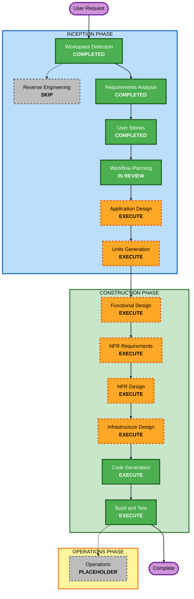

# Execution Plan

## Detailed Analysis Summary

### Project Context

- **Project**: AI-DLC GUI Application Development Platform
- **Project Type**: Greenfield
- **Primary User**: 社内向けCRUDアプリを作りたい非エンジニア
- **Target MVP**: 社内向けCRUDアプリ生成に特化したAI-DLC GUIプラットフォーム
- **Primary Platform**: Responsive web application
- **Deployment Target**: AWS Amplify Hosting
- **Repository Integration**: GitHub
- **Database Scope**: PostgreSQL + Prisma
- **AI Provider Strategy**: AI Provider Adapter with Amazon Bedrock first

### Change Impact Assessment

- **User-facing changes**: Yes
  - 新規GUIプラットフォームであり、企画、要件、設計、実装、テスト、デプロイ、改善提案までの画面体験を提供する。
- **Structural changes**: Yes
  - AI-DLCワークフロー、プロジェクト管理、承認ゲート、AI生成、GitHub連携、AWSデプロイ、監査ログを分離した構成が必要。
- **Data model changes**: Yes
  - Project、Requirement、Question/Answer、Screen、Data Model、Task、Generated Artifact、Approval、GitHub Operation、Deployment、Audit Eventが必要。
- **API changes**: Yes
  - プロジェクト、要件、設計、コード生成、テスト、GitHub、AWSデプロイ、履歴管理のAPIが必要。
- **NFR impact**: Yes
  - セキュリティ、監査可能性、ユーザビリティ、テスト容易性、外部公開時のアクセス制御、コスト確認が重要。

### Risk Assessment

- **Risk Level**: High
- **Rollback Complexity**: Moderate
- **Testing Complexity**: Complex
- **Reasoning**:
  - GitHub、AWS Amplify Hosting、PostgreSQL、Prisma、AI Provider Adapter、承認ゲート、監査ログ、セキュリティブロッカーが絡む。
  - MVP範囲はCRUD生成に制限されているためCriticalではないが、安全性と連携の設計品質が重要。

### Security and PBT Constraints

- **Security Baseline**: 有効。重大なセキュリティ違反はブロッキング、軽微な指摘は警告。
- **Blocking Security Areas**:
  - シークレットのハードコード
  - 過剰なIAM権限
  - 認証またはアクセス制限なしの外部公開
  - 危険なAWSリソース削除
  - ユーザーデータの不適切な送信
  - 未承認の本番デプロイ
- **PBT Scope**: 限定範囲で有効。
  - 純粋関数、バリデーション、データ変換、シリアライズ/デシリアライズ、正規化、AI生成成果物スキーマ検証に適用。

## Workflow Visualization

### Mermaid Diagram

### Text Alternative

1. Workspace Detection: Completed
2. Reverse Engineering: Skipped because this is a greenfield target application
3. Requirements Analysis: Completed
4. User Stories: Completed
5. Workflow Planning: In review
6. Application Design: Execute
7. Units Generation: Execute
8. Functional Design: Execute
9. NFR Requirements: Execute
10. NFR Design: Execute
11. Infrastructure Design: Execute
12. Code Generation: Execute
13. Build and Test: Execute
14. Operations: Placeholder

## Phases to Execute

### INCEPTION PHASE

- [x] Workspace Detection - COMPLETED
  - **Rationale**: Workspace state and greenfield classification were needed.
- [x] Reverse Engineering - SKIPPED
  - **Rationale**: Target application code does not exist yet. `aidlc-workflows/` is a reference rules repository, not the target implementation.
- [x] Requirements Analysis - COMPLETED
  - **Rationale**: Requirements were needed due to a complex new platform scope.
- [x] User Stories - COMPLETED
  - **Rationale**: Multiple personas, GUI journeys, approval gates, and acceptance criteria are central to the product.
- [x] Workflow Planning - IN REVIEW
  - **Rationale**: Required to set execution path and stage decisions.
- [ ] Application Design - EXECUTE
  - **Rationale**: New components, service boundaries, workflow orchestration, AI provider abstraction, GitHub/AWS integrations, and approval/audit responsibilities must be designed.
- [ ] Units Generation - EXECUTE
  - **Rationale**: The platform naturally decomposes into multiple units: project workflow, requirements, design, generation, GitHub, deployment, audit, security, and testing.

### CONSTRUCTION PHASE

- [ ] Functional Design - EXECUTE
  - **Rationale**: Per-unit business behavior, approval logic, state transitions, and validation rules need detailed definition.
- [ ] NFR Requirements - EXECUTE
  - **Rationale**: Security, auditability, usability, testability, deployment reliability, and cost awareness are core requirements.
- [ ] NFR Design - EXECUTE
  - **Rationale**: Security baseline, PBT scope, secrets handling, external publication checks, logging, and monitoring patterns require design decisions.
- [ ] Infrastructure Design - EXECUTE
  - **Rationale**: AWS Amplify Hosting, GitHub integration, PostgreSQL connectivity, secrets handling, and deployment checks require infrastructure mapping.
- [ ] Code Generation - EXECUTE
  - **Rationale**: Always executed. Implementation plan and code generation are required.
- [ ] Build and Test - EXECUTE
  - **Rationale**: Always executed. Build verification, tests, PBT-applicable checks, and deployment readiness must be validated.

### OPERATIONS PHASE

- [ ] Operations - PLACEHOLDER
  - **Rationale**: AI-DLC operations workflow is a placeholder in the current rules. MVP stories include lightweight log review and improvement suggestions, handled through construction outputs and product requirements.

## Proposed Unit Decomposition

Initial unit boundaries for later Units Generation:

1. **Project and Workflow State Unit**
   - Project creation, AI-DLC state, phase progression, review gates.
2. **Requirements and Story Intake Unit**
   - Idea input, AI questions, requirement artifacts, story artifacts.
3. **Application Design and Task Planning Unit**
   - Screen list, data model, task decomposition, design approval.
4. **AI Provider Adapter Unit**
   - Bedrock-first adapter, provider abstraction, future provider extension.
5. **GitHub Integration Unit**
   - Repository connection/creation, branch management, Pull Request workflow.
6. **Code Generation and Diff Review Unit**
   - Template generation, code generation, diff summary, scope expansion detection.
7. **Testing and Quality Unit**
   - Unit/integration/E2E test orchestration, failure summaries, PBT-applicable checks.
8. **Deployment and AWS Integration Unit**
   - Deployment pre-check, Amplify Hosting deployment, status/result handling.
9. **Security and Audit Unit**
   - Security blockers/warnings, approvals, operation history, summarized AI logs.
10. **Operations Feedback Unit**
   - Log review, error summaries, improvement suggestions.

## Estimated Timeline

- **Total Remaining Executable Stages**: 8
- **Estimated Duration**: Large project; expect multiple iterations across design, units, construction, and build/test.
- **Recommended Approach**: Complete all Inception artifacts before code generation. Then implement units in dependency-aware order.

## Success Criteria

- **Primary Goal**: Produce a working MVP of an AI-DLC GUI platform for generating and deploying internal CRUD applications.
- **Key Deliverables**:
  - Application design artifacts
  - Unit decomposition artifacts
  - Per-unit functional and NFR design
  - Infrastructure design for GitHub, Amplify Hosting, PostgreSQL, and secrets
  - Generated Next.js/TypeScript application code
  - Tests including PBT for applicable logic
  - Build and test summary
- **Quality Gates**:
  - Requirements approval
  - User stories approval
  - Workflow plan approval
  - Application design approval
  - Design/unit approval before construction
  - Implementation diff approval
  - Test result approval
  - Deployment approval

## Workflow Planning Compliance Summary

### Content Validation

- Mermaid node IDs use simple alphanumeric identifiers.
- Mermaid labels use quoted labels and ` ` as used in existing AI-DLC rules.
- A text alternative is included for the workflow visualization.

### Security Baseline

- No blocking security finding exists in this plan.
- Security-sensitive stages are marked EXECUTE.
- Security blockers are included as quality gates and design constraints.

### Property-Based Testing

- No blocking PBT finding exists in this plan.
- PBT-applicable logic is included in testing and construction planning.
